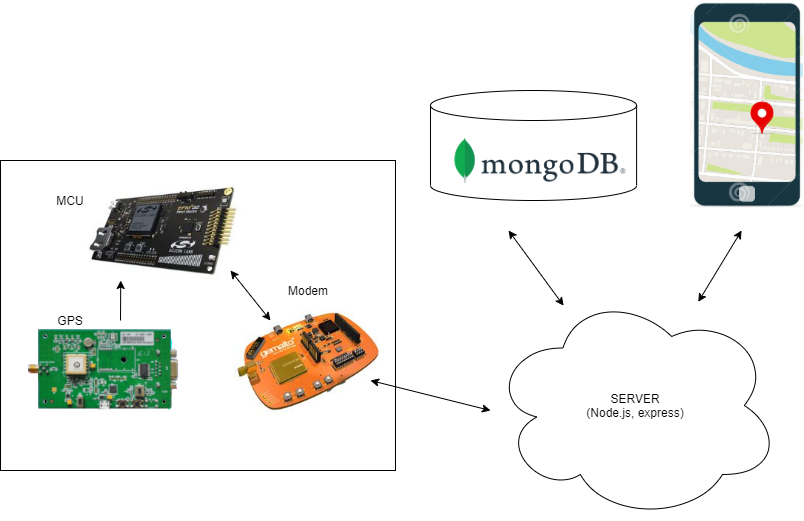
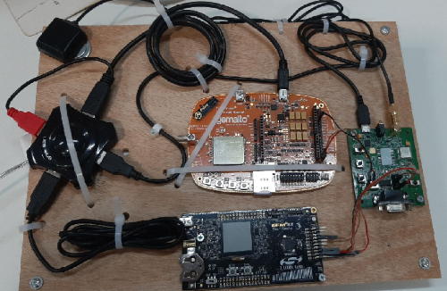
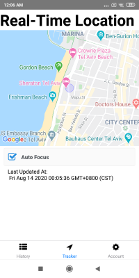
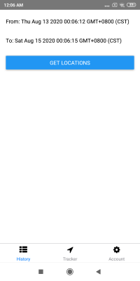
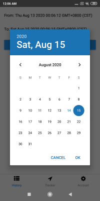

# Mobile-Embedded-Locator: Summary
This project implements an end-to-end 'locator-system': an embedded package that transmits its location to the server and a mobile app that displays the locations on real time on the map.
General scheme:

## 1. Authentication
In order to perform any actions, both the embedded package and the mobile-app are required to perform a user authentication with username and password using a JWT.

## 2. Embedded package

Includes: MCU (Silabs), GPS (quectel) and a modem (Gemalto). All drivers are written on C.
The MCU workflow is:
1. Initialize the gps and the modem
2. Server authentication - get a JWT
3. periodically, obtain the current location and transmit to the server (http)

## 3. Mobile-app
  
  

A react-native app, developed with Expo.
1. The user is first required to signin with username and password
2. The app retrieves the corresponding embedded package locations from the DB and displays them on the map on realtime.
3. The user can pick a time-range in order to show the chip's route within it.

## 4. Server
Implemented with Node.js and Express.
Gets both the mobileapp and embedded package requests and communicates with the DB.

## 5. Database
A mongoDB instance.
MongoDB allows a very comftorable work with JSON files.
